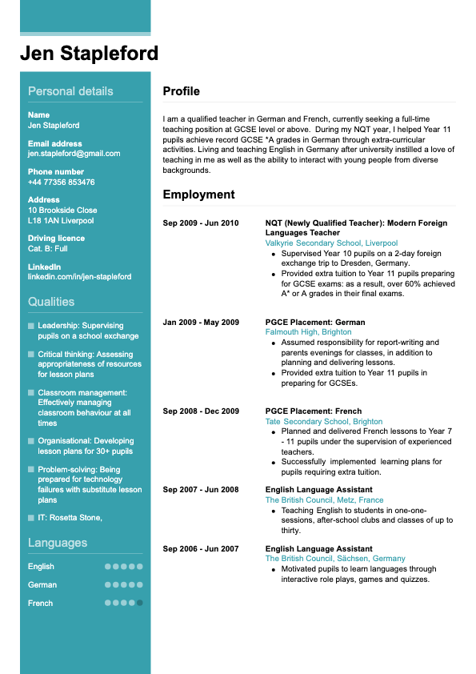

# resume-template2
You can run this project on any IDE. if you want to show out put open html file with your browser.

This is html,css based template that i made for resume.

https://github.com/jahanzaib2353/resume-template2/blob/main/Web%20capture_28-8-2023_22139_.jpeg.crdownload)

